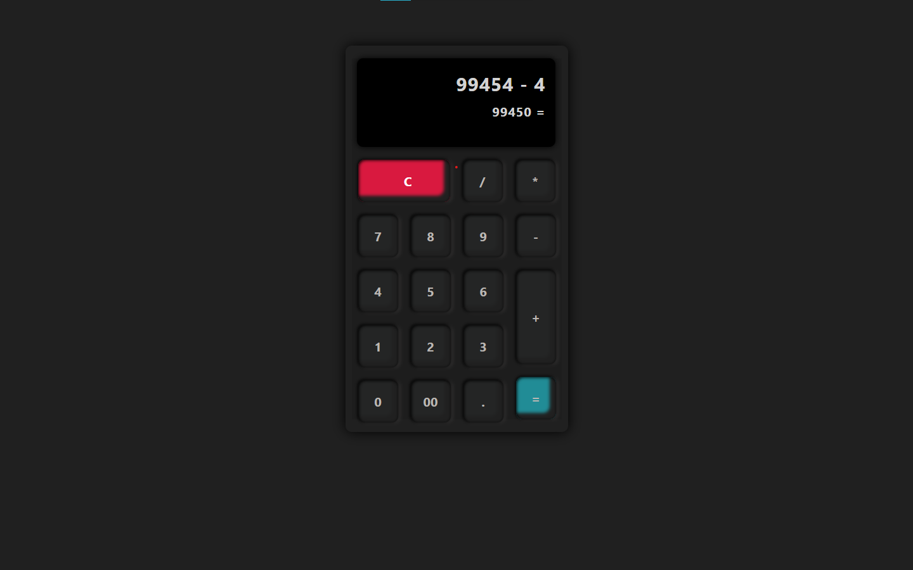

# HTML/CSS calculator

## Description
A responsive calculator with a sleek design, implemented using only HTML and CSS.

## Preview

<a href="https://codebyfaisal.github.io/project1" target="_blank">Project Preview</a>

## 🖥️ What is included?
- **Stylish CSS**: Designed to give the calculator a sleek and modern look.
- **User Friendly Interface**: Intuitive design for easy use.
- **Float implementation**: Uses float for flexible and responsive layout.
- **Responsive Design**: Ensures optimal display on different screen sizes and devices.

## Contributions
Contributions are welcome! If you have any suggestions, feature requests, or bug fixes, feel free to raise an issue or submit a pull request.

## License
This project is licensed under the MIT License - see the [LICENSE](LICENSE) file for details.

---

If you find it useful, Clone this repository! don't forget to star⭐ the project. ✨
